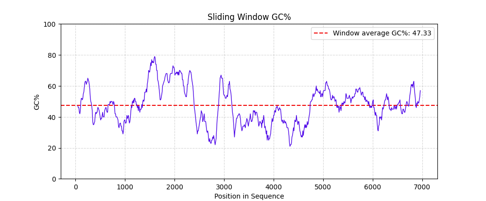

# omiBio - A lightweight and easy-to-use Python bioinformatics toolkit.

[](https://github.com/LK923/omiBioKit/releases)
[](https://www.python.org/)

## Introduction
```omiBio``` (omiBioKit) is an open-source Python 3 package that is lightweight, easy to use, and publicly available, suitable for education, general bioinformatics, and scientific research.

- Provides various commonly used bioinformatics data structures, such as Sequence and Polypeptide, as well as a variety of corresponding methods, and offers optional validity checks.
- For users accustomed to using functional interfaces, we have also encapsulated most of the class methods into functions.
- rovides tools for reading and writing general bioinformatics files (such as FASTA), taht is easy to use, and produces clear results.
- Provides a variety of commonly used analysis tool functions, with a rich set of optional parameters, making it easy to use and flexible.
- Provide command-line interfaces for commonly used tools.
- Provides simple visualization tools (based on matplotlib).

## Usage example
#### Creating a sliding window GC chart using ```omiBio```:
```python
from omibio.analysis import sliding_gc, draw_sliding_gc
from omibio.io import read

seq_dict = read("./example.fasta")  # Reading FASTA file
dna: Sequence = seq_dict["example"]  # Get Sequence

gc_list = sliding_gc(dna, window=200, step=20)  # Get GC data from the sliding window
draw_sliding_gc(gc_list, seq=dna, window_avg=True)  # Visualization

```
The above code will produce results like this:
___
<p align="center">
  
</p>

#### Using ```omiBio```'s command-line tools:
```bash
$ omibio orf example.fasta --min-length 100
```
The above CLI will produce results like this:
```bash
example_2    70      289     -       -2      219
example_16   53      257     +       +3      204
example_13   118     301     +       +2      183
example_4    92      272     -       -1      180
example_2    157     322     +       +2      165
example_5    17      173     -       -1      156
example_16   176     332     -       -1      156
example_3    177     324     -       -3      147
example_19   172     319     -       -2      147
example_1    44      188     +       +3      144
example_16   120     264     +       +1      144
example_17   164     308     -       -1      144
example_19   180     309     -       -3      129
example_3    68      194     -       -1      126
example_13   188     299     -       -1      111
example_17   93      201     +       +1      108
example_5    80      185     +       +3      105
example_11   214     319     +       +2      105
example_9    35      137     -       -1      102
example_13   134     236     +       +3      102
example_15   226     328     +       +2      102
example_17   114     216     -       -3      102

```
## Installation

Install from PyPI:

```bash
$ pip install omibio
```